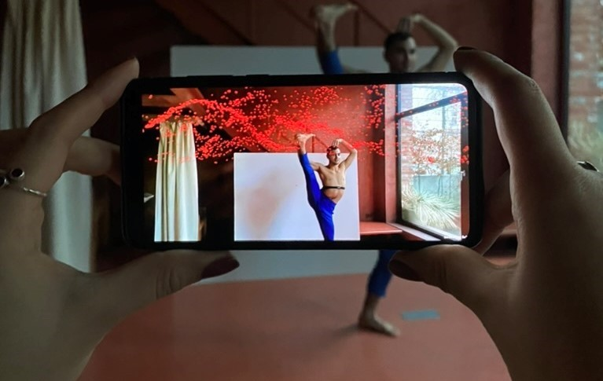
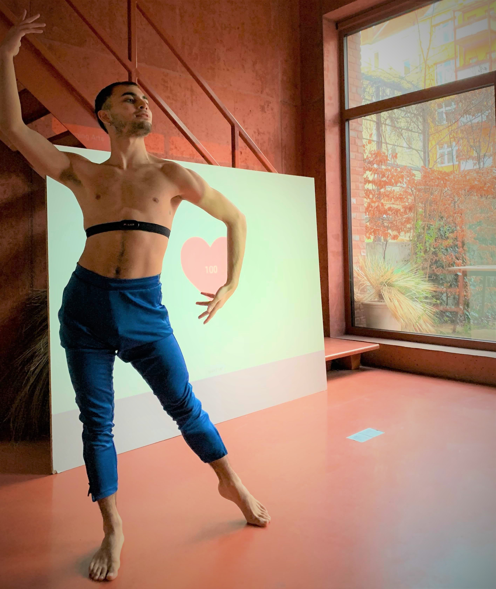
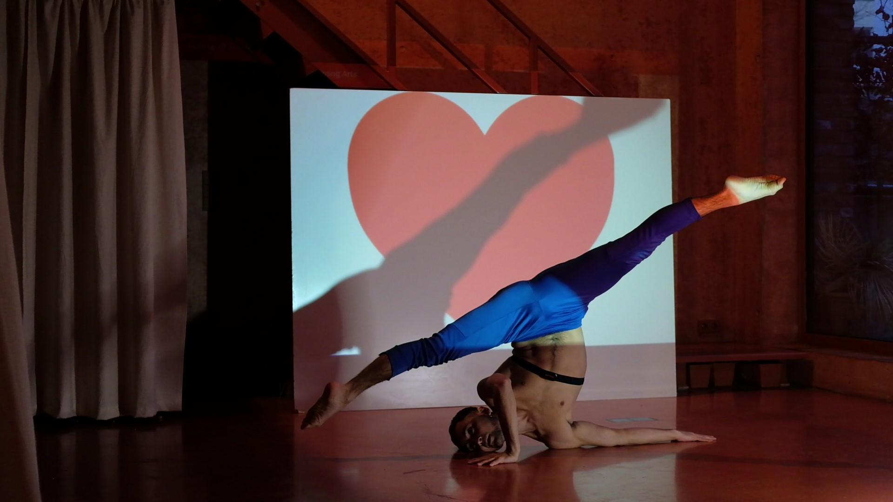
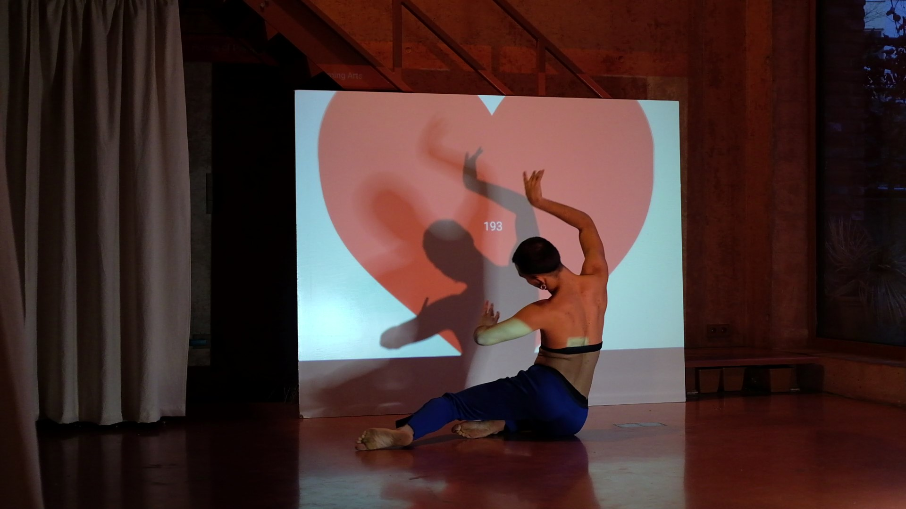

# HeartBeats

**An XR performance installation using real-time biosensor data to drive interactive audiovisual elements.**

Built with Unity 3D (OpenXR) and Android Studio for a collaboration project, "Future of Performing Arts with XR Technologies" between TU Berlin and Empiria Theatre Zagreb.

## Project Overview

HeartBeats was developed as an interaction concept that translates live biosensor data into real-time audiovisual output within a performance context.

A dancer wears a Polar H10 chest sensor. An Android application connects via Bluetooth (Polar BLE SDK) and maps the heart rate to 18 audio files at different BPMs. The audience views the scene through an AR application (Noise Flowfield, Unity 3D) that creates a 3D particle visualization reacting to the audio environment: amplitude controls particle speed and rotation via linear interpolation, and the spectrum (8 bands) maps to particle color and size.

## Demo

[▶️ Watch the demo on Vimeo](https://vimeo.com/690889831)

## System Architecture

**Polar H10 Sensor:** High-accuracy chest-worn heart rate sensor, connected via Bluetooth using the Polar BLE SDK.

**EKG Sound Generator (Android Studio):** Receives heart rate data, maps it to 18 audio files at different BPMs, and generates a heart animation scaled to heart rate.

**Noise Flowfield (Unity 3D, OpenXR):** AR application that extracts microphone input, uses the amplitude to control particle speed and rotation via linear interpolation, and maps the audio spectrum (8 bands) to particle color and size.

## Performance Documentation

Because heart rate is highly individual and influenced by emotional state, the sound mapping had to be calibrated specifically for the performer. The heart rate range during solo development differed significantly from rehearsal conditions with an audience present, requiring iterative adjustment of the BPM thresholds to account for performance-related arousal.

<table><tr>
<td></td>
<td></td>
</tr></table>

## Team

Orhun Caglidil, Elisabeth Oswald, Anna Petrouffa, Rhea Widmer (TU Berlin), Lorenzo Cocchia (Politecnico di Milano)

